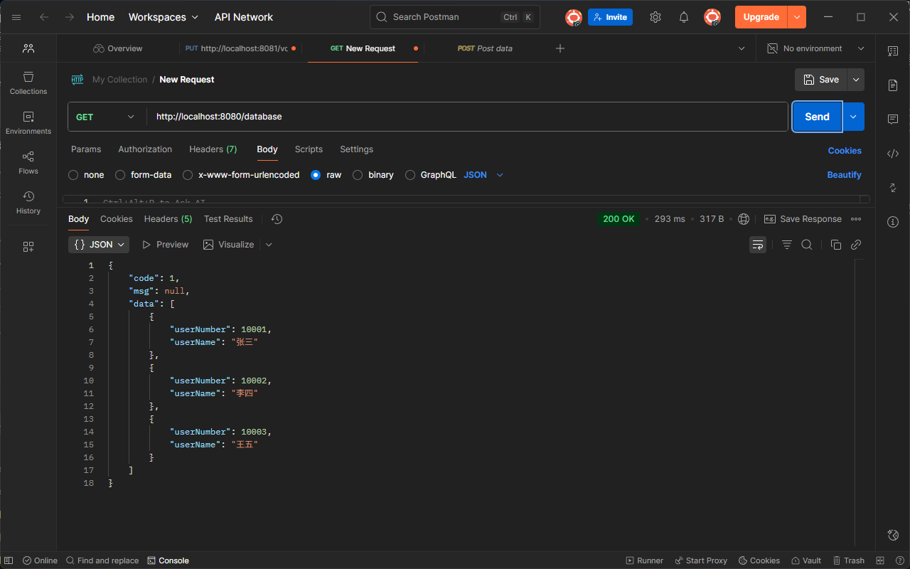
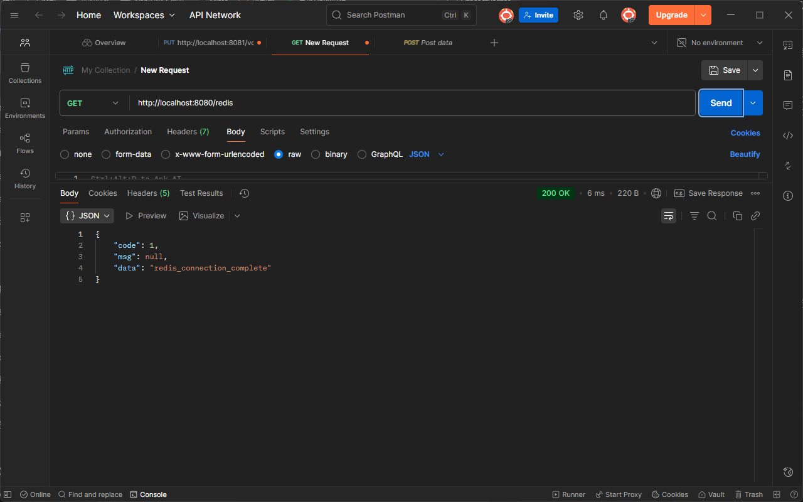

这是个模拟项目，主要看能不能解决好自己机子上的配置问题。在这个项目的pom里放着以后可能会用到的所有依赖。

## 数据库建表

打开mysql workbench，登录了以后打开这个文件夹里的MySQL脚本，直接全部执行

如果想删掉这个数据库，就执行这个脚本的第一行

## redis

本来想在云服务器上放redis的，但试了一天半死活连不上，就只能拿Windows版的redis凑合用着了。使用时先打开redis文件夹下的`redis-server.exe`，只要这个窗口留着，本地的redis就是开着的。

然后打开同文件夹下`redis-cli.exe`，输入指令

```bash
SET test redis_connection_complete
```

回车，此时应该会显示`OK`。

可以用`keys *`查看所有的键，用`get test`查看刚才插入的值是什么。

## 项目启动

这个项目留了两个接口

- `localhost:8080/database` 访问数据库的全部数据
- `localhost:8080/mysql` 访问redis里的字符串

要是这两个接口都能跑通，就没什么问题。

期望数据



